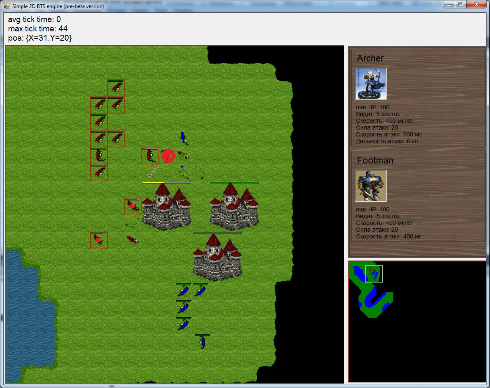

# Simple 2D RTS Engine
Simple two-dimensional real-time strategy engine on C#

Microsoft games XNA used for rendering, so it has to be installed before building

**engine implements the following:**
- Game map loaded from bmp file, opened and dark cells for each player
- Minimap
- Animation of units
- Units actions: moving (with pathfinding), attack (both near-range and far-range attack with bullets), "move and attack all enemies who will be met", death if hit points is over
- Buildings (not fully tested)
- Controlling of units in classic RTS style (left mouse button for selecting, right for command)
- Panel with information about selected units
- high-level behaviour modules:
    - "Investigate map" algorithm - high-level command for units which divide them into groups and make each group walk through map to investigate dark cells as much as possible
    
	TODO: develop more high-level behaviour modules which may be used in generic computer enemy behaviour

**Optimizations of pathfinding:**

- Using algorithm "jump point search" (more faster) instead of A* (https://habrahabr.ru/post/162915/)
- Pathfinding between far points (at different sides of map) calculated in two steps: first step is "macro-pathfinding" between areas of map, second step is pathfinding between cells within one area
- Using path-caching: if path is already calculated by near unit it will be partially used again
- Special pathfinding optimization in cases of moving groups of units

**Version**

0.1 beta
